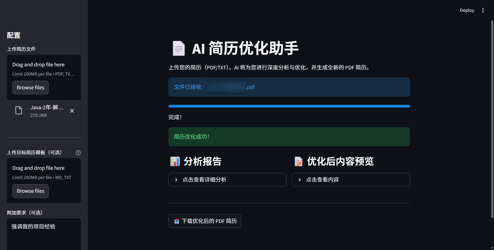

# AI Resume Optimizer Agent

基于 **LangChain + LangGraph + DeepSeek** 构建的 AI 简历优化助手。该项目采用 Agent 架构（感知-分析-规划-执行-行动），能够深度分析简历内容，结合用户需求进行针对性优化，并自动生成排版精美的 PDF 简历。



## ✨ 核心功能

1.  **多模态感知**：支持上传 PDF、TXT、Markdown 等格式的简历文件。
2.  **智能 Agent 工作流**：
    *   **感知 (Perception)**: 解析简历文件内容。
    *   **分析 (Analysis)**: 扮演资深 HR 角色，深度剖析简历优缺点。
    *   **规划 (Planning)**: 结合用户附加要求，制定详细修改计划。
    *   **执行 (Execution)**: 重写简历内容，确保专业、精炼且符合 Markdown 格式。
    *   **行动 (Action)**: 调用渲染引擎生成最终 PDF 文件。
3.  **用户定制化**：支持用户输入附加要求（如“强调 Java 经验”、“缩减篇幅”等），Agent 会将要求注入到 Prompt 中进行定向优化。
4.  **可视化界面**：提供基于 Streamlit 的 Web 界面，操作简单直观。

## 🛠️ 技术栈

*   **LLM**: DeepSeek-V3 (兼容 OpenAI 接口)
*   **Framework**: LangChain, LangGraph
*   **Frontend**: Streamlit
*   **Tools**: PyPDF (读取), ReportLab (生成 PDF)

## 🚀 快速开始

### 1. 克隆项目

```bash
git clone <your-repo-url>
cd langchain-demo
```

### 2. 环境配置

建议使用 Python 3.10+ 创建虚拟环境：

```bash
# 创建虚拟环境
python -m venv .venv

# 激活环境 (Windows)
.\.venv\Scripts\activate

# 激活环境 (Mac/Linux)
source .venv/bin/activate
```

安装依赖：

```bash
pip install -r requirements.txt
pip install streamlit langgraph pypdf reportlab markdown
```

### 3. 配置 API Key

在项目根目录创建 `.env` 文件，并填入你的 DeepSeek API Key：

```env
DEEPSEEK_API_KEY=sk-your-deepseek-key
DEEPSEEK_BASE_URL=https://api.deepseek.com/v1
DEEPSEEK_MODEL=deepseek-chat
```

### 4. 运行应用

启动 Streamlit 前端：

```bash
streamlit run app.py
```

浏览器会自动打开 `http://localhost:8501`。

## 📂 目录结构

```
langchain-demo/
├── agent_demo.py       # Agent 核心逻辑 (StateGraph定义)
├── app.py              # Streamlit 前端页面
├── main.py             # LLM 初始化配置
├── tools.py            # 工具函数 (文件读取、PDF生成、字体管理)
├── requirements.txt    # 项目依赖
├── fonts/              # 字体目录 (存放中文字体)
├── .env                # 环境变量 (需自行创建)
└── output/             # 生成结果目录 (自动忽略)
```

## ⚠️ 注意事项

*   **字体支持**：项目已内置字体管理逻辑，优先使用 `fonts/ChineseFont.ttf`，如不存在则自动回退到系统字体（SimHei/Microsoft YaHei）。
*   上传的文件和生成的结果分别存储在 `temp_uploads/` 和 `output/` 目录中。

## 📄 License

MIT
